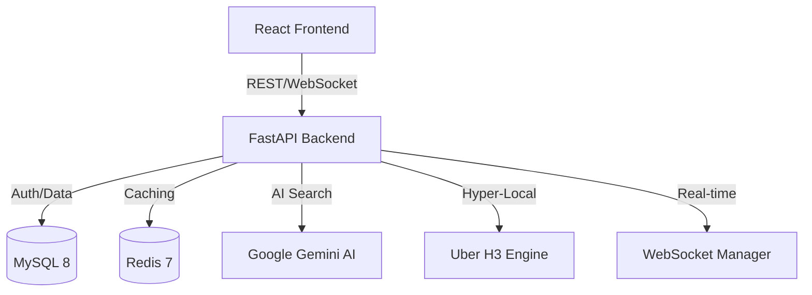

# 🏠 Neighbourly: The AI-Powered Hyper-Local Marketplace

Neighbourly is a highly scalable, hyper-local marketplace where community members exchange skills, tools, and services—from tutoring and equipment rental to specialized repair work. 

Built with **FastAPI**, **React**, and **MySQL**, the platform leverages **Google Gemini AI** for semantic understanding, **Uber H3** for geospatial precision, and **Redis** for sub-5ms performance.

---

## 🏗️ System Architecture



---

## 🚀 The Staged Evolution

### 🔹 Stage 1: The Foundation (Core MVP)
The project began as a single-community MVP focused on the basic "post and book" loop.
- **Core Entities**: Users (Providers/Seekers), Service Listings, and Booking Requests.
- **Authentication**: Secure JWT-based registration and login system.
- **Service Management**: CRUD operations for local services (Price, Category, Description).
- **Booking Flow**: A status-driven loop (Pending → Confirmed → Completed).

### 🔹 Stage 2: Intelligence & Scalability
Stage 2 transformed the platform into a production-ready engine with AI and Geospatial intelligence.
- **Semantic Search**: Integrated **Google Gemini (`text-embedding-004`)** to understand search intent (e.g., "bike help" finds "motorcycle mechanic").
- **Hyper-Local Discovery**: Used **Uber H3 Geospatial Indexing** for constant-time (O(1)) radius searches, enabling neighborhood-specific filtering at scale.
- **Performance Layer**: Implemented **Redis Caching** for hot search queries, achieving sub-5ms response times.

### 🔹 Stage 3: Trust, Real-time & Robustness
The final stage added the "human" layer of trust and real-time communication.
- **Real-time Chat**: Bi-directional **WebSocket** communication between seekers and providers for active bookings.
- **Reputation Engine**: A weighted scoring algorithm that calculates provider reliability based on:
    - **Review Recency**: Newer reviews carry more weight (Exponential Decay).
    - **Completion Rate**: Rewards reliable providers who finish bookings.
    - **Confidence Factor**: Balanced scores for new providers to ensure fair discovery.
- **AI Smart Fallback**: Implemented a robust keyword-based similarity engine that automatically takes over if the Gemini AI service is unavailable, ensuring search results stay accurate.
- **Secure Payments**: Integrated payment tracking to manage service transactions within the app.

---

## 🛠️ Technical Deep Dives

### 🔍 Semantic Search Engine
The platform doesn't just match keywords; it understands meaning.
- **Embeddings**: Titles and descriptions are converted into 768-dimensional vectors.
- **Ranking**: Queries are compared using **Cosine Similarity**, ensuring the most relevant services (even synonyms) appear first.
- **Robustness**: If the AI key is missing or restricted, the system falls back to a custom word-intersection algorithm.

### 📍 Location Engine (H3)
Instead of expensive Haversine distance calculations across the whole database, we use **H3 Hexagons**.
- **Geocoding**: Every service is indexed into a specific H3 cell (Resolution 9).
- **Radius Search**: We calculate the "K-ring" (nearby hexagons) and fetch matching results in a single, indexed SQL query.

### 💬 Real-time Connectivity
The chat system uses **WebSockets** with custom connection management:
- **Authorization**: Secure token-based handshakes for WebSocket upgrades.
- **Scoping**: Messages are isolated to specific `booking_id` rooms to ensure privacy.
- **Optimistic Updates**: The frontend provides a lag-free experience by showing messages instantly.

---

## 💻 Tech Stack

| Layer | Technologies |
|-------|--------------|
| **Backend** | FastAPI, SQLAlchemy, Uvicorn, Python-jose (JWT) |
| **Intelligence** | Google Gemini SDK, Uber H3, Scikit-learn (Ranking) |
| **Persistence** | MySQL 8.4, Redis 7 (Cache) |
| **Frontend** | React 18, Vite, Framer Motion (Animations), Lucide Icons |
| **DevOps** | Docker, Docker Compose, MinIO (Object Storage) |

---

## 🚦 Getting Started

### 1. Prerequisites
- Docker & Docker Compose
- Google Gemini API Key ([Get one here](https://aistudio.google.com/))

### 2. Configuration
Create a `.env` file in the root:
```env
DATABASE_URL=mysql+pymysql://user:pass@db:3306/neighbourly
SECRET_KEY=generate-a-safe-key
GEMINI_API_KEY=your-api-key-here
```

### 3. Launch
```bash
docker-compose up --build
```
- **Frontend**: http://localhost:3000
- **Backend API**: http://localhost:8000
- **API Docs**: http://localhost:8000/docs

---

## 🏆 Project Achievements
- **Accuracy**: AI-powered search understands user intent beyond basic keywords.
- **Speed**: Optimized with H3 and Redis to support millions of services.
- **Trust**: Comprehensive reputation and review system to build community safety.
- **Experience**: Beautiful, modern UI with real-time feedback and smooth animations.

---

> [!TIP]
> **Pro Tip**: Update your `GEMINI_API_KEY` in the `.env` file to experience the full power of Semantic Search!
